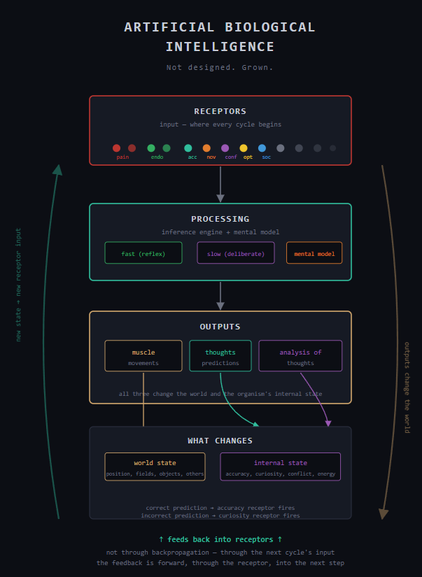
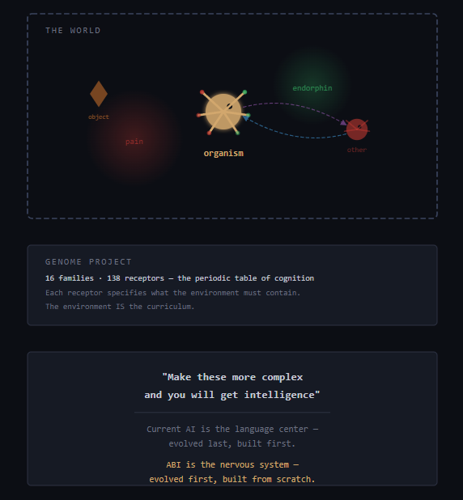

# Artificial Biological Intelligence (ABI)

**Intelligence whose shape is determined by the evolutionary history of its receptor topology. Not designed. Grown.**

### The Question

What receptor topology emerges when you run evolutionary selection in an environment where the concepts are load-bearing for survival, and what does that tell you about the structure of intelligence itself?

### The Journey

ABI starts where evolution started — a simple organism in a liquid environment with endorphin/pain receptors and muscles — and builds upward through 60 steps to grounded language, evolutionary receptor topology discovery, physics-world interaction, abstract problem-solving, and a laboratory for the dynamics of intelligence itself.

Current AI starts where evolution finished (language) and tries to work downward toward grounding it may never reach. ABI starts at the bottom and builds up. Slower. But the foundations are actually there when you need them.




---

## The Core Idea

Agency is a continuous variable determined by receptor complexity, effector complexity, and the processing in between. **Capability without receptor is latent and never gets used.** The receptor is not separate from cognition — it IS why the capability gets deployed at all. Motivation and cognition are the same thing, viewed from different angles.

The architecture has three components that current AI conflates into one:
- **The transformer** is the inference engine (it processes, it doesn't store)
- **The mental model** is the knowledge base (explicit, queryable cause-effect mappings)
- **The experience log** is ground truth (append-only, immutable, no learned process can overwrite it)

This separation dissolves grounding, compartmentalization, legibility, unlearning, and safe failure as problems.

[Theoretical Foundations](docs/THEORY.md) | [Serialization Thesis](docs/SERIALIZATION_THESIS.md) | [Theories Index](docs/THEORIES.md)

---

## Key Terminology

### Core Concepts

**Receptor**: An input to the organism's cognitive system. Receptors exist at three levels of abstraction:
- **Low-level receptors**: Read the world directly. Raw or minimally processed sensory data from the environment — pain intensity at a specific limb, temperature, pressure, chemical concentration, endorphin. What's happening to the body right now.
- **High-level receptors**: Read the content of the organism's own processing — which concepts activated, which patterns matched, which causal chains the mental model retrieved, what was specifically predicted. These are receptors for detected concepts in the thoughts. The organism senses what it's thinking about, not just that it's thinking. Examples: concept match (a compressed causal chain was recognized), pattern availability (a known motif applies here), planning value (the mental model predicts this action is better than inaction).
- **Meta-receptors**: Read the consequences and cost of processing itself. Not what was thought, but how the thinking went — whether predictions succeeded, what processing cost, whether the corrective response is helping or amplifying the problem. Examples: accuracy (prediction was correct), curiosity (prediction was wrong), conflict (competing demands can't be satisfied together), processing speed (how well the current model fits the current input), response loop detection (the corrective response IS the problem).

**Each receptor (whether low or high level) becomes associated with endorphins or pain through learned experience.** The mental model stores cause-effect mappings like: `state{curiosity=high} + explore_action → state{endorphin=high}`. The transformer learns to act on curiosity because the mental model predicts it leads to good outcomes. These associations emerge from survival, not from specification. A curiosity receptor that leads to finding food becomes rewarding through learned experience; the same receptor topology in a dangerous environment might learn the opposite association.

The key principle: **capability without receptor is latent and never gets used.** A system might be *capable* of sophisticated prediction or planning, but without receptors that detect when to use those capabilities, and without learned associations between those receptors and survival outcomes, they remain dormant. Motivation and cognition are the same thing, viewed from different angles.

**Receptor Topology**: The complete collection and arrangement of receptors an organism has — the specific set of cognitive capabilities available to it. Different environments produce different receptor topologies. The topology is a fossil record of the selection pressures that shaped it.

**Mental Model**: A separate, explicit database storing cause-effect mappings of the form: `action → receptor state change, time delay, certainty`. This is where predictions and causal chain retrievals live. This is also where the associations between high-level receptors and outcomes are learned and stored. The mental model is queryable, has addresses for every fact, and lives outside the transformer.

**Transformer**: The inference engine that maps receptor inputs to muscle outputs. It processes but does not store. It uses knowledge retrieved from the mental model but doesn't contain knowledge itself.

**Experience Log**: An append-only, immutable record of every action-observation pair the organism has experienced. Ground truth. No learned process can overwrite it.

**Observation Vector**: The full input vector fed to the transformer at each timestep, containing all receptor values (both low-level and high-level) concatenated together.

**The Forward-Feedback Loop**: The core mechanism. Receptors → processing → outputs (muscle movements, thoughts, analysis of thoughts) → outputs change the world and the organism's internal state → changed state becomes the next cycle's receptor input. The feedback is forward, through the receptor, into the next step. Not through backpropagation — through the next cycle's input.

### Developmental Terms

**Proprioception**: Sensing your own body's position and configuration (where your limbs are, joint angles, body heading).

**Efference Copy**: Internal prediction of the sensory consequences of your own actions. Before executing a muscle command, the system predicts what receptor changes that action should cause. Mismatch between prediction and actual outcome signals external intervention or controllability limits.

**Grounded Language**: Language where every word maps to a receptor state the organism actually experienced. Not statistical word embeddings, but explicit pointers to sensorimotor patterns. "Pain" maps to obs[0:5] firing when limb tips contact pain field sources. "Self" maps to the controllability decomposition. The grounding is inspectable — you can trace any word to the receptor state it refers to.

**Cultural Transmission**: Transfer of knowledge between organisms via mental model replication. One organism's cause-effect database can be copied (not trained) into another organism. The original +223% claim was retracted after controlled decomposition — the benefit is training-time observation enrichment, not inference-time modulation. The architectural separation remains valuable for legibility, compartmentalization, and cross-generational knowledge transfer.

### Evolutionary Terms

**Deep Time Learning**: Learning that happens across generations, where each generation inherits the receptor topology that proved adequate and starts from a richer cognitive foundation than the one before. The task isn't specified — it emerges from what the environment makes load-bearing over sufficient generational depth. Distinct from gradient descent (training runs) and reinforcement learning (episodes).

**Environment Tiers**: Progressively more complex environments (8 levels in current implementation). Each tier is derived from the genome project — the environment must contain the causal structure necessary for specific receptors to evolve. Lower tiers produce simpler receptor topologies; higher tiers produce different (not just more) receptors.

**Topology Bias Inheritance**: Offspring inherit their parent's receptor topology as a *prior*, not hardwired. The offspring must rediscover the receptors through experience, but convergence accelerates dramatically (from 15 training epochs in generation 0 to 0 epochs by generation 4). Evolution of learning mechanisms, not just evolution of behavior.

**Cross-Tier Transfer**: Training an organism in environment tier X, then testing performance in tier Y. Reveals which receptor families are universal (transfer broadly) vs specialized (must be learned in target environment). Result: social skills transfer universally (11-25x), tool use resists transfer.

**Probe-Gated Inheritance**: Topology bias is gated by a constitutional probe budget. The organism must actually probe and explore the environment to validate inherited priors — inheritance accelerates but doesn't bypass the need for grounded experience. The probe rate floor lives outside the genome and cannot be selected to zero.

**Genome Project**: The formal specification of the receptor search space — 173 receptors across 21 families. The periodic table of cognitive capabilities. Each receptor entry specifies what environmental structure it detects, what survival cost the organism pays for missing it, and what must already exist before it can emerge. The genome project is load-bearing on environmental design: the 173 receptors are 173 environmental design requirements.

**Invariant Trunk**: The set of receptors that emerge in every environment regardless of tier or complexity. 18 receptors are invariant across all 8 physics-world tiers — these are the strongest candidates for universal cognitive primitives.

### Key Theoretical Contributions

**The Serialization Thesis**: Sequential processing of simultaneously-available information is not a hardware bottleneck but an evolved optimization — temporal decomposition creates prediction opportunities that parallel processing destroys. Each processing stage generates expectations about what the next stage will reveal; the delta is where learning happens.

**Per-Receptor Pipeline Architecture**: Every receptor family has its own evolved temporal decomposition strategy, optimized for the prediction structure of its specific domain. Pain processes coarse-to-fine-to-contextual; curiosity processes novelty-to-relevance-to-strategy.

**Annealing Discovery (T57)**: The framework's first structural self-discovery. Releasing certainty on conflict entries (annealing) produces more genuine conflict resolutions than protecting them (shielding). Conflict resolution works by releasing commitment, not by protecting it. Supported across 6 seeds, pre-registered as rival to T55 (which was directionally falsified).

---

## What's Implemented

### The Cognitive Sequence (Steps 1-30)
A 6-limbed organism in a 2D liquid environment learns to navigate pain/endorphin fields via a transformer outputting binary muscle activations. Each step earns its complexity from the step below:

| Phase | Steps | What develops |
|-------|-------|---------------|
| Sensorimotor Foundation | 1-4 | Pain/endorphin receptors, metabolic economy, hierarchical nervous system |
| Adaptive Sensing | 5-8 | Temporal association, spatial memory, habituation, distance sensing |
| World Modeling | 9-13 | Causal mental model, curiosity, pattern recognition, multiple hypotheses |
| Self-Model | 14-18 | Proprioception, efference copy, controllability, planning |
| Social Cognition | 19-24 | Proto-symbols, NPC opponent, empathy, intentional signaling, shared vocabulary |
| Higher Cognition | 25-29 | Optimism, conflict receptor, arbitration, metacognition, concepts |
| Language | 30 | Grounded language — every word maps to a receptor state |

### Evolutionary Infrastructure (Steps 31-43)
- **Environment tiers** (8 levels, genome-driven) from simple field navigation to meta-cognitive self-regulation
- **Receptor discovery** — 165 null-calibrated tests detecting which of 173 genome receptors have emerged
- **Topology bias inheritance** — offspring inherit receptor topology priors, probe-gated
- **Population evolution** — 8 competing organisms, social arms race
- **Cross-tier transfer** — 8x8 transfer matrix
- **LLM grounding bridge** — connecting the mental model to language

### Physics World (Steps 48-55)
- **Rigid body simulation** (pymunk) with organism body, limbs, and objects
- **Grip mechanics** — automatic grip on contact + extension, energy cost
- **Compound objects** — levers (pin joints), spring gates, hinged barriers
- **Developmental body changes** — limb growth, receptor sensitivity maturation
- **Persistent world state** — environmental modifications carry across episodes
- **Canopy activation sweep** — receptor discovery across physics world at all 8 tiers

### Staged Observation Processing (Step 50)
- **4-stage pipeline** with inter-stage predictions testing the serialization thesis
- Body Immediate (39 dims) -> Spatial/Temporal (59 dims) -> Action/Agency (37 dims) -> Social/Cognitive (34 dims)
- Inter-stage prediction MSE decreases over training (learnable prediction structure)
- Staged model outperforms flat model on val accuracy (95.5% vs 94.5%)

### Abstract & Self-Modification Environments (Steps 56-58)
- **T7**: 8 causal graph templates, hidden variables, zone consumption order matters
- **T8**: 8 skill zones, 5 difficulty levels, Ship of Theseus test, curriculum design
- **Combined**: abstract problems at varying difficulty with self-directed skill development

### Closed-Loop Training
- Mental model online during data generation — features computed inline at correct lag
- Eliminates the augmentation pipeline's leakage class entirely
- 7% exploration + 2% null-action probes for counterfactual variation

### The Genome Project (20 families, 166 receptors)
A formal specification of the receptor search space — the periodic table of cognitive capabilities:

| Family | Receptors | From -> To |
|--------|-----------|-----------|
| Repetition | 6 | Static repetition -> causal rhythms |
| Association | 8 | Spatial co-occurrence -> relational analogy |
| Similarity | 7 | Perceptual features -> structural invariance |
| Causality | 11 | Coincidence -> causal graphs |
| Agency | 8 | Controllability -> niche construction |
| Meta-Motivational | 13 | Curiosity -> metacognition |
| Regulatory | 9 | Stress detection -> emotional intelligence |
| Social | 14 | Other detection -> moral reasoning |
| Compression | 15 | Pattern recognition -> constraint shape -> shaped absence -> missing piece located -> analogy |
| Observation | 8 | Change detection -> meta-observation |
| Formalization | 11 | Rule extraction -> optimization -> theory formation |
| Mathematics | 7 | Quantity -> necessity -> proof -> formal composition |
| Organization | 7 | Boundary -> part-whole -> system detection |
| Self-Augmentation | 5 | Capability change -> metamorphic planning |
| Interaction | 7 | Response recognition -> contact response -> grip -> lever -> composite affordance |
| Environmental Augmentation | 5 | Change detection -> developmental environment engineering |
| Sequential Processing | 5 | Stage prediction -> prediction architecture awareness |
| Epistemic | 4 | Belief detection -> doubt -> counterfactual salience -> epistemic strategy |
| Perception | 5 | Staged processing -> response loop detection |
| Logic | 6 | Semantic relations -> transitivity -> conjunction -> quantifier -> contradiction -> it_follows |
| Language | 3 | Naming -> self-talk -> referential grounding |
| Bridging | 4 | Mimicry -> trust -> executability -> translation |

### Key Empirical Results

- **60 receptors genuinely discovered** out of 164 testable (1 skipped for missing component), against null-calibrated thresholds (95th percentile of shuffled-log scores). Of these, 51 are independent evidence channels (correlated tests not double-counted).
- **18 invariant receptors** across all 8 physics-world tiers — including grip_affordance and push_affordance as part of the embodied trunk
- **Complexity reshapes, doesn't expand**: discovery count flat at 27-33/52 across all tiers and environment types (field, physics, T7+T8)
- **Topology inheritance**: convergence accelerates from 15 epochs to 0 across generations
- **Social universally transferable**: any prior training helps social environments (11-25x)
- **Tool use resists transfer**: must be learned directly in the target environment
- **T57 annealing supported** (6 seeds): releasing certainty on conflict entries produces more resolutions than protecting them. First structural self-discovery.
- **T55 directionally falsified**: read-shielding was protecting the wrong thing
- **Cultural transmission revised**: +223% claim retracted after decomposition; benefit is training-time observation enrichment, not inference-time modulation
- **Staged processing**: inter-stage prediction MSE decreases 25% over training; staged model outperforms flat on val accuracy with more engaged slow pathway

### Theories Index

76 formal theoretical claims indexed in `theories.md`:
- 6 supported by experimental evidence
- 1 revised after controlled decomposition
- 1 directionally falsified (T55, replaced by T57 annealing)
- 44 proposed with falsification criteria

---

## Quick Start

### Requirements
```
Python 3.10+
PyTorch
NumPy
pymunk (for physics world)
```

### Run the organism
```bash
cd src
python environment.py          # Test the organism (all body plans)
python train.py                # Full training pipeline (500 episodes, ~10 min)
python model.py                # Model architecture summary
```

### Closed-loop training (recommended)
```python
from train import generate_training_data_closed_loop, train_model
X, Y, Z, log, engine = generate_training_data_closed_loop(
    num_bootstrap=100, num_online=400, steps_per_episode=300, seed=42)
model = train_model(X, Y, Z, epochs=30, staged=True)
```

### Run the visualization
Open `visualization/index.html` in a browser after training (loads `src/data/replay.json`).

### Run the laboratory
```bash
python receptor_discovery.py   # Full 148-test receptor battery with null calibration
python environment_tiers.py    # Test all 8 environment tiers
python canopy_sweep.py         # Physics-world receptor sweep across tiers
python full_receptor_battery.py # 3-environment comparison (field, physics, T7+T8)
python t54_v2_experiment.py    # T54/T57 rationalization/annealing experiment
python abstract_env.py         # T7 abstract + T8 self-modification environments
python population_evolution.py # Population evolution (8 organisms)
python cross_tier_transfer.py  # Cross-tier transfer matrix
```

### Scale testing
```bash
python scaling.py              # Limb count, segments, 3D, diversity, generational
```

---

## Architecture

```
169-dim observation vector --> HierarchicalPolicy --> 22-bit action vector
                                    |
                    +---------------+---------------+
                    |               |               |
              FastPathway      SlowPathway       Router
              (MLP reflex)   (2-layer transformer) (confidence+energy+conflict)
              + pain pred    + StagedInputProjection  |
                    |          (4-stage pipeline)      |
                    |               |                  |
                    +--------> ArbitrationHead <-------+
                           (5 receptor group weights)
                                    |
                              Blended output
                                    |
                    +---------------+---------------+
                    |               |               |
              18 muscle bits   4 emission bits   Mental Model
              (6 limbs x 3)   (signal vocab)   (26K+ mappings)
```

### Observation Vector (169 dims)
Pain(6), endorphin(6), temperature(6), chemical(6), pressure(6), fatigue(6), energy(1), temporal aversion(6), receptor gain(6), pain memory(25), distance sensing(16), prediction error(6), mental model features(4), pattern features(2), kinematics(2), limb deviations(6), efference copy(22), agency(3), object proximity(3), object responding(3), NPC obs(12), optimism(2), conflict(3), concepts(2), grip state(6), physics(3)

### Staged Processing Pipeline
```
Stage 1 [Body: 39d] --> predict Stage 2 --> Stage 2 [Spatial: 59d] --> predict Stage 3
    --> Stage 3 [Action: 37d] --> predict Stage 4 --> Stage 4 [Social: 34d] --> transformer
```

---

## The Thesis

Intelligence is what happens when you run evolutionary receptor topology selection long enough in a rich enough environment. It is not a property you design into a system. It is a property that grows out of a process.

The organism builds the world that builds the organism that builds the next world.

Not simulation. Not reconstruction. Generation.

---

## Academic Context

The core claims find support across four research communities (see `docs/WHITEPAPER.md` Section 10):
- **Grounded cognition**: Barsalou (2008), O'Regan & Noe (2001)
- **Active inference**: Friston's free energy framework
- **Inverse phylogeny**: Trends in Cognitive Sciences (2023)
- **Embodied cognition**: Phil. Trans. Royal Society B (2024)
- **Ecological realism**: Gibson (1979) — accepted for embodied coupling, diverged on the necessity of internal models
- **Enactivism**: Varela, Thompson, Rosch (1991) — accepted for action-coupled cognition, diverged on prediction requiring internal models

The serialization thesis extends Friston: organisms don't just minimize prediction error, they manufacture prediction opportunities through sequential processing architecture. The per-receptor pipeline claim — that each receptor family has its own evolved temporal decomposition strategy — goes beyond anything in the current embodied cognition literature.

No existing program unifies these threads. The receptor topology as a single generative mechanism — from grounding through compartmentalization to language — appears to be a novel synthesis.

---

## Project Structure

```
abi/
+-- src/                          # Core implementation
|   +-- environment.py            # Organism, NPC, Environment classes
|   +-- model.py                  # HierarchicalPolicy (fast/slow/router/arbitration/staged)
|   +-- train.py                  # Training pipeline (augmented + closed-loop)
|   +-- mental_model.py           # Causal mental model (encoder, mappings, patterns)
|   +-- physics_world.py          # Pymunk rigid body simulation + grip + compounds
|   +-- environment_tiers.py      # 8 tiered environments (genome-driven)
|   +-- abstract_env.py           # T7 abstract + T8 self-modification environments
|   +-- receptor_discovery.py     # 148 receptor emergence tests with null calibration
|   +-- topology_inheritance.py   # Multi-generational topology bias inheritance
|   +-- population_evolution.py   # Population evolution (8 organisms)
|   +-- evolutionary_sweep.py     # Cross-tier evolutionary sweep
|   +-- cross_tier_transfer.py    # Transfer matrix across tiers
|   +-- canopy_sweep.py           # Physics-world receptor sweep
|   +-- full_receptor_battery.py  # 3-environment receptor comparison
|   +-- t54_v2_experiment.py      # Rationalization/annealing experiment
|   +-- scaling.py                # Scaling experiments (limbs, segments, 3D)
|   +-- grounding.py              # Grounded language dictionary
|   +-- llm_grounding.py          # LLM grounding bridge
+-- genome_project/               # Receptor search space specification
|   +-- families/                 # 21 receptor family YAMLs (173 receptors)
|   +-- schemas/                  # Receptor schema definition
|   +-- docs/                     # Cross-family dependencies, overview
+-- theories.md                   # 76 indexed theoretical claims with status
+-- serialization_thesis.md       # The serialization thesis (standalone paper)
+-- visualization/                # Three.js organism visualization
+-- docs/                         # Whitepaper, roadmap, framework documents
+-- results/                      # Experimental results (JSON + FINDINGS.md)
+-- LICENSE                       # MIT License
```

---

## Contributing

The genome project is designed to be extended. Each receptor entry specifies what environmental structure it detects, what would falsify it, and what must already exist before it can emerge. New receptor families, deeper environment tiers, and empirical tests against the predictions are all welcome.

The theory learns most from its failures. T55 (read-shielding) was directionally falsified and replaced by T57 (annealing) — and that falsification led to the Epistemic family, the first family predicted by an experimental result rather than by theoretical deduction. Which genome predictions don't hold? Which receptors emerge where not predicted? Which never emerge where predicted? Each discrepancy is where the framework needs revision — and revision is growth.

---

## License

MIT License. See [LICENSE](LICENSE).
