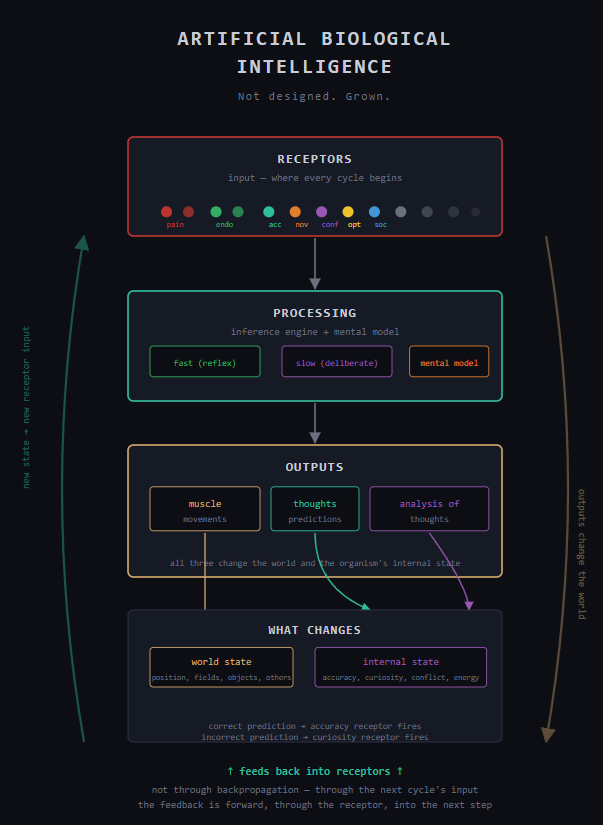
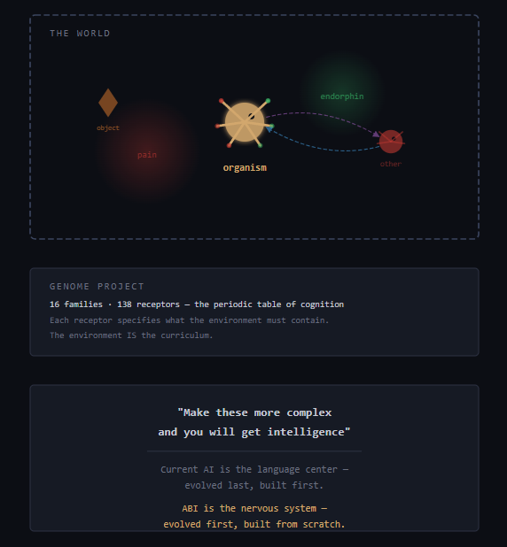
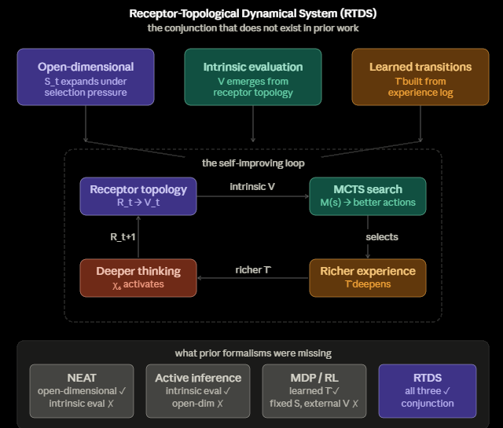

# Artificial Biological Intelligence (ABI)

**Intelligence whose shape is determined by the evolutionary history of its receptor topology. Not designed. Grown.**

### The Question

What receptor topology emerges when you run evolutionary selection in an environment where the concepts are load-bearing for survival, and what does that tell you about the structure of intelligence itself?

### The Journey

ABI starts where evolution started — a simple organism in a liquid environment with endorphin/pain receptors and muscles — and builds upward through 60 steps to grounded language, evolutionary receptor topology discovery, physics-world interaction, abstract problem-solving, and a laboratory for the dynamics of intelligence itself.

Current AI starts where evolution finished (language) and tries to work downward toward grounding it may never reach. ABI starts at the bottom and builds up. Slower. But the foundations are actually there when you need them.




---

## The Core Idea

Agency is a continuous variable determined by receptor complexity, effector complexity, and the processing in between. **Capability without receptor is latent and never gets used.** The receptor is not separate from cognition — it IS why the capability gets deployed at all. Motivation and cognition are the same thing, viewed from different angles.

The architecture has three components that current AI conflates into one:
- **The transformer** is the inference engine (it processes, it doesn't store)
- **The mental model** is the knowledge base (explicit, queryable cause-effect mappings)
- **The experience log** is ground truth (append-only, immutable, no learned process can overwrite it)

This separation dissolves grounding, compartmentalization, legibility, unlearning, and safe failure as problems.

[Theoretical Foundations](docs/THEORY.md) | [Serialization Thesis](docs/SERIALIZATION_THESIS.md) | [Theories Index](docs/THEORIES.md) | [Structured Open Variables](docs/sov/)

---

## Key Terminology

### Core Concepts

**Receptor**: An input to the organism's cognitive system. Receptors exist at three levels of abstraction:
- **Low-level receptors**: Read the world directly. Raw or minimally processed sensory data from the environment — pain intensity at a specific limb, temperature, pressure, chemical concentration, endorphin. What's happening to the body right now.
- **High-level receptors**: Read the content of the organism's own processing — which concepts activated, which patterns matched, which causal chains the mental model retrieved, what was specifically predicted. These are receptors for detected concepts in the thoughts. The organism senses what it's thinking about, not just that it's thinking. Examples: concept match (a compressed causal chain was recognized), pattern availability (a known motif applies here), planning value (the mental model predicts this action is better than inaction).
- **Meta-receptors**: Read the consequences and cost of processing itself. Not what was thought, but how the thinking went — whether predictions succeeded, what processing cost, whether the corrective response is helping or amplifying the problem. Examples: accuracy (prediction was correct), curiosity (prediction was wrong), conflict (competing demands can't be satisfied together), processing speed (how well the current model fits the current input), response loop detection (the corrective response IS the problem).

**Each receptor (whether low or high level) becomes associated with endorphins or pain through learned experience.** The mental model stores cause-effect mappings like: `state{curiosity=high} + explore_action → state{endorphin=high}`. The transformer learns to act on curiosity because the mental model predicts it leads to good outcomes. These associations emerge from survival, not from specification. A curiosity receptor that leads to finding food becomes rewarding through learned experience; the same receptor topology in a dangerous environment might learn the opposite association.

The key principle: **capability without receptor is latent and never gets used.** A system might be *capable* of sophisticated prediction or planning, but without receptors that detect when to use those capabilities, and without learned associations between those receptors and survival outcomes, they remain dormant. Motivation and cognition are the same thing, viewed from different angles.

**Receptor Topology**: The complete collection and arrangement of receptors an organism has — the specific set of cognitive capabilities available to it. Different environments produce different receptor topologies. The topology is a fossil record of the selection pressures that shaped it.

**Mental Model**: A separate, explicit database storing cause-effect mappings of the form: `action → receptor state change, time delay, certainty`. This is where predictions and causal chain retrievals live. This is also where the associations between high-level receptors and outcomes are learned and stored. The mental model is queryable, has addresses for every fact, and lives outside the transformer.

**Transformer**: The inference engine that maps receptor inputs to muscle outputs. It processes but does not store. It uses knowledge retrieved from the mental model but doesn't contain knowledge itself.

**Experience Log**: An append-only, immutable record of every action-observation pair the organism has experienced. Ground truth. No learned process can overwrite it.

**Observation Vector**: The full input vector fed to the transformer at each timestep, containing all receptor values (both low-level and high-level) concatenated together.

**The Forward-Feedback Loop**: The core mechanism. Receptors → processing → outputs (muscle movements, thoughts, analysis of thoughts) → outputs change the world and the organism's internal state → changed state becomes the next cycle's receptor input. The feedback is forward, through the receptor, into the next step. Not through backpropagation — through the next cycle's input.

**Thought**: A thought is a cycle — or cascade of cycles — in which internal receptors dominate the loop. External receptors (pain, temperature, pressure) fire from the world. Internal receptors (certainty, learning progress, conflict, pattern activation) fire from the mental model's processing. All of them feed into the policy as inputs. When the organism is primarily responding to its own receptor firings rather than to the world, that is a thought. Certainty drops, which fires the conflict receptor, which changes the prediction, which fires the learning progress receptor, which updates certainty — the cycle runs internally. Each receptor that fires is an input. Each input shapes the next cycle. The participating set of receptors is the *content* of the thought. The number of cycles before the cascade resolves or exits through the motor system is the *depth* of the thought. A reflex is one cycle dominated by external receptors. A thought is multiple cycles dominated by internal ones.

**Context**: The slow pathway's transformer processes the last 32 timesteps of receptor firings with causal attention. This is the organism's context — the recent history of what it sensed, thought, and did that can influence the current cycle. Unlike LLM context, where everything the model knows must be in the token window, ERTI separates context from memory. The mental model sits outside the context window as a separate addressable store with 26K+ causal mappings. It injects summary features (certainty, learning progress, controllability) into the observation vector at every timestep, so its state is *represented* in context through receptor channels, but the full knowledge base is external and retrieved on demand. When the organism thinks — internal receptors firing across multiple cycles — those firings accumulate in the sequence window. The organism attends to its own recent thoughts. The mental model gives it depth beyond 32 steps. The sequence window gives it continuity within them.

**Error Correction**: Prediction error is a receptor. The mental model predicts what will change (`predict_delta`), the world delivers the actual change, and the mismatch fires as an input to the next cycle. The organism *senses* its own errors. This operates at three timescales. *Immediate*: prediction error fires as a receptor, the transformer sees it in the next timestep's context, and the organism can act on the fact that it was wrong — explore, withdraw, update strategy. Error correction is a thought, not a training step. *Medium-term*: the mental model's certainty mechanism — wrong predictions reduce certainty on the responsible entries, right predictions increase it, so bad mappings lose influence over time. *Long-term*: gradient-based training adjusts policy weights across episodes. The first two timescales operate at runtime — the organism corrects errors while it's living, through the same receptor loop that constitutes thought.

**Planning**: Planning is the mental model running `predict_delta` for actions the organism hasn't taken. The organism asks "what if I do X" and the mental model returns predicted receptor state changes with certainty scores. Those predicted states fire internal receptors — optimism if the predicted outcome is good, conflict if two actions both predict pain, curiosity if the prediction is uncertain. Those receptor firings feed back as input to the next cycle, which can evaluate another candidate action or explore deeper consequences of the first. Planning is a thought where the mental model is the dominant source of receptor firings — the organism is responding to *predicted futures*. The depth of planning is how many cycles of predict-compare-predict the organism runs before committing to motor output.

**Decision-Making**: A decision is when a thought's cascade exits through the motor system. The internal receptor firings converge — one action pathway dominates — and the transformer produces muscle activations. Which receptors participated determines the character of the decision: pain-memory dominance produces risk-aversion, curiosity dominance produces exploration, unresolved conflict produces hesitation. The fast/slow pathway split maps directly onto this — the fast pathway is a decision without planning (one cycle, external receptors in, motor output out), the slow pathway is a decision with planning (the transformer attends to recent internal deliberation across the sequence window), and the Router is deciding whether to plan at all.

**Thinking Substrate (MCTS)**: Monte Carlo Tree Search provides the concrete substrate that makes metacognition tractable. The tree is an architectural component — alongside the mental model and experience log — that records which thinking paths were taken, how often, and with what outcomes. The tree's metadata is itself input to receptors: visit count patterns trigger the shaped_absence receptor (underexplored regions of thought), UCB scores trigger curiosity (high-uncertainty branches worth exploring), value convergence triggers completion (the search has resolved), path divergence triggers exception_detection (something about this thinking path is different from what the pattern predicted), and high-value low-visit branches trigger optimization (there's a better reasoning path the organism hasn't been taking). The receptor topology makes the tree's evaluation function intrinsic — the value of a thinking path is determined by which receptors fire at its terminus, not by a designer-specified objective. This creates a self-modifying loop with no fixed ceiling: better receptor topology → better evaluation → better search → richer tree → deeper metacognitive analysis → receptor firings that develop better topology. The loop stabilizes only when the environment stops presenting structure worth detecting — and since the environmental augmentation family lets the organism increase environmental complexity, the ceiling rises with the organism. Receptors are the only cognitive unit that generalizes across every level of this loop because they fire on conditions regardless of origin — environment, internal processing, tree structure, or analysis of the analysis. Reward functions are level-specific. Loss functions are task-specific. Only the receptor scales.

### Developmental Terms

**Proprioception**: Sensing your own body's position and configuration (where your limbs are, joint angles, body heading).

**Efference Copy**: Internal prediction of the sensory consequences of your own actions. Before executing a muscle command, the system predicts what receptor changes that action should cause. Mismatch between prediction and actual outcome signals external intervention or controllability limits.

**Grounded Language**: Language where every word maps to a receptor state the organism actually experienced. Not statistical word embeddings, but explicit pointers to sensorimotor patterns. "Pain" maps to obs[0:5] firing when limb tips contact pain field sources. "Self" maps to the controllability decomposition. The grounding is inspectable — you can trace any word to the receptor state it refers to.

**Cultural Transmission**: Transfer of knowledge between organisms via mental model replication. One organism's cause-effect database can be copied (not trained) into another organism. The original +223% claim was retracted after controlled decomposition — the benefit is training-time observation enrichment, not inference-time modulation. The architectural separation remains valuable for legibility, compartmentalization, and cross-generational knowledge transfer.

### Evolutionary Terms

**Deep Time Learning**: Learning that happens across generations, where each generation inherits the receptor topology that proved adequate and starts from a richer cognitive foundation than the one before. The task isn't specified — it emerges from what the environment makes load-bearing over sufficient generational depth. Distinct from gradient descent (training runs) and reinforcement learning (episodes).

**Environment Tiers**: Progressively more complex environments (8 levels in current implementation). Each tier is derived from the genome project — the environment must contain the causal structure necessary for specific receptors to evolve. Lower tiers produce simpler receptor topologies; higher tiers produce different (not just more) receptors.

**Topology Bias Inheritance**: Offspring inherit their parent's receptor topology as a *prior*, not hardwired. The offspring must rediscover the receptors through experience, but convergence accelerates dramatically (from 15 training epochs in generation 0 to 0 epochs by generation 4). Evolution of learning mechanisms, not just evolution of behavior.

**Cross-Tier Transfer**: Training an organism in environment tier X, then testing performance in tier Y. Reveals which receptor families are universal (transfer broadly) vs specialized (must be learned in target environment). Result: social skills transfer universally (11-25x), tool use resists transfer.

**Probe-Gated Inheritance**: Topology bias is gated by a constitutional probe budget. The organism must actually probe and explore the environment to validate inherited priors — inheritance accelerates but doesn't bypass the need for grounded experience. The probe rate floor lives outside the genome and cannot be selected to zero.

**Genome Project**: The formal specification of the receptor search space — 236 receptors across 25 families (including proprioception and the visual pattern family). The periodic table of cognitive capabilities. Each receptor entry specifies what environmental structure it detects, what survival cost the organism pays for missing it, and what must already exist before it can emerge. The genome project is the seed, not the ceiling — automatic receptor discovery (T125) finds new receptors beyond the genome through conflation-driven tree ensembles.

**Invariant Trunk**: The set of receptors that emerge in every environment regardless of tier or complexity. 18 receptors are invariant across all 8 physics-world tiers — these are the strongest candidates for universal cognitive primitives.

### Key Theoretical Contributions

**The Serialization Thesis**: Sequential processing of simultaneously-available information is not a hardware bottleneck but an evolved optimization — temporal decomposition creates prediction opportunities that parallel processing destroys. Each processing stage generates expectations about what the next stage will reveal; the delta is where learning happens.

**Per-Receptor Pipeline Architecture**: Every receptor family has its own evolved temporal decomposition strategy, optimized for the prediction structure of its specific domain. Pain processes coarse-to-fine-to-contextual; curiosity processes novelty-to-relevance-to-strategy.

**Annealing Discovery (T57)**: The framework's first structural self-discovery. Releasing certainty on conflict entries (annealing) produces more genuine conflict resolutions than protecting them (shielding). Conflict resolution works by releasing commitment, not by protecting it. Supported across 6 seeds, pre-registered as rival to T55 (which was directionally falsified).

**The Cartographical Theory (T127)**: Understanding is mapping the space of possible processing orders. The organism discovers the structure of any input — sound, light, touch — by exploring different ways of processing it and recording which processing choices produce which prediction profiles. The map of the processing space IS the understanding. Different environments select for different maps. Cartography solves FEP's local minima problem: the organism avoids getting trapped by mapping the global landscape instead of following local gradients. Empirically confirmed across voice differentiation, visual classification, and three survival environments.

**Theory Generation Through Receptor Topology (T114)**: Theories are common patterns in the causal mental model that survive across contexts. A confirmed theory IS a receptor — promoted into the observation vector because it reliably predicts. Theory generation and testing are not separate subsystems — they are what receptor topology intelligence does naturally. The policy IS the mental model. The no-transformer organism confirmed this: 0.93-1.11x of transformer fitness with no trained policy, just causal patterns from experience.

**Unified Wave Processing**: Sound and light are both waves. One STFT pipeline processes all modalities — amplitude, frequency, phase decomposition applied identically to audio (2 receptor points), visual (64 spatial points), and touch (6 limb points). The organism discovers modality-specific structure from the signal's own properties, not from designed feature extractors.

---

## What's Implemented

### The Cognitive Sequence (Steps 1-30)
A 6-limbed organism in a 2D liquid environment learns to navigate pain/endorphin fields via a transformer outputting binary muscle activations. Each step earns its complexity from the step below:

| Phase | Steps | What develops |
|-------|-------|---------------|
| Sensorimotor Foundation | 1-4 | Pain/endorphin receptors, metabolic economy, hierarchical nervous system |
| Adaptive Sensing | 5-8 | Temporal association, spatial memory, habituation, distance sensing |
| World Modeling | 9-13 | Causal mental model, curiosity, pattern recognition, multiple hypotheses |
| Self-Model | 14-18 | Proprioception, efference copy, controllability, planning |
| Social Cognition | 19-24 | Proto-symbols, NPC opponent, empathy, intentional signaling, shared vocabulary |
| Higher Cognition | 25-29 | Optimism, conflict receptor, arbitration, metacognition, concepts |
| Language | 30 | Grounded language — every word maps to a receptor state |

### Evolutionary Infrastructure (Steps 31-43)
- **Environment tiers** (8 levels, genome-driven) from simple field navigation to meta-cognitive self-regulation
- **Receptor discovery** — 186 null-calibrated tests with per-test null types (action-shuffled, block-permuted, NPC-appearance-permuted, Granger causality), 3 negative controls
- **Topology bias inheritance** — offspring inherit receptor topology priors, probe-gated
- **Population evolution** — 8 competing organisms, social arms race
- **Cross-tier transfer** — 8x8 transfer matrix
- **LLM grounding bridge** — connecting the mental model to language

### Physics World (Steps 48-55)
- **Rigid body simulation** (pymunk) with organism body, limbs, and objects
- **Grip mechanics** — automatic grip on contact + extension, energy cost
- **Compound objects** — levers (pin joints), spring gates, hinged barriers
- **Developmental body changes** — limb growth, receptor sensitivity maturation
- **Persistent world state** — environmental modifications carry across episodes
- **Canopy activation sweep** — receptor discovery across physics world at all 8 tiers

### Staged Observation Processing (Step 50)
- **4-stage pipeline** with inter-stage predictions testing the serialization thesis
- Body Immediate (39 dims) -> Spatial/Temporal (59 dims) -> Action/Agency (37 dims) -> Social/Cognitive (34 dims)
- Inter-stage prediction MSE decreases over training (learnable prediction structure)
- Staged model outperforms flat model on val accuracy (95.5% vs 94.5%)

### Abstract & Self-Modification Environments (Steps 56-58)
- **T7**: 8 causal graph templates, hidden variables, zone consumption order matters
- **T8**: 8 skill zones, 5 difficulty levels, Ship of Theseus test, curriculum design
- **Combined**: abstract problems at varying difficulty with self-directed skill development

### Self-Play & Thinking Substrate (Steps 59-60)
- **Self-play pipeline** — policy drives behavior, oracle removed after bootstrap
- **MCTS thinking substrate** — organism thinks before acting; tree metadata (visit entropy, best value, value convergence, path divergence, underexplored, depth reached) feeds back as 6 receptor channels
- **Cognitive state channels** — thought_type_id (256-entry codebook of co-activation patterns) + concept_id (which stored concept was retrieved) at obs[175:177]
- **Thinking influence** — 5 of 6 channels active by self-play iteration 5; +23.3 reward difference over non-thinking organisms
- **Batched predict_delta** — 4.4x speedup; embedding cache in MCTS nodes eliminates redundant encoder calls
- **Procedural memory** — PeakExperienceIndex, ReplayEngine, MotorSequenceStore (action recipes keyed on thought_type_id), ShortcutExecutor (state machine bypassing MCTS when confident match exists, zeroing thinking_channels to starve the anxiety loop)

### Deep Time with Thinking (80 generations seed 42, 40 generations seed 99)
- **161 unique receptors** discovered across 80 generations (up from 75 at gen 0)
- **53 receptors gained** through evolution alone — including full epistemic chain, metacognition, theory of mind, nested theory of mind, meta-observation, self-regulation, niche construction
- **21 receptors lost** — complexity reshapes topology (T27 confirmed)
- **Peak thinking influence** at generation 7: partial correlation 0.376
- **Novel receptor detection** — scanning mental model for distinctions the genome didn't anticipate; 5 detections across 80 gens, all contextual_signal_interpretation variants
- **Heritable parameters** — MERGE_THRESHOLD, V weights (6 coefficients), thinking_budget, thinking_cost all evolve under selection
- **Co-activation analysis** — 281 unique thought types observed; anxiety loop (pain<->conflict) persists in 9/10 generations
- **Cross-environment transfer** — 71 shared receptors, 30 transfer-only, 27 naive-only. T95: trunk is universal, canopy is biography

### Closed-Loop Training
- Mental model online during data generation — features computed inline at correct lag
- Eliminates the augmentation pipeline's leakage class entirely
- 7% exploration + 2% null-action probes for counterfactual variation
- EntityRelationStore wired in — observe_npc called every step for social cognition
- Peak experience indexing and replay during low-demand periods
- Motor sequence extraction from high-reward contiguous runs

### Environment Enrichment
- **Multi-NPC observation** — closest of 4 profiled NPCs (cooperative, competitive, erratic, deceptive) visible to organism
- **Strategic deception NPC** — context-dependent lying (signals endorphin near pain, signals pain near endorphin)
- **Non-stationary rules** — T7 trigger signals rotate between phases
- **Stochastic hidden confounders** — 3-state Markov chain modulating 4 modalities simultaneously
- **Cross-modal objects** — sources with correlated pain + temperature + chemical signatures
- **Territorial environment** — ownership boundary receptor with unattributable delayed penalties

### The Surprise Economy (NEXT_SURPRISE Phases 1-2)
- **SurpriseTokenizer** — lived experience tokenizes into sparse surprise events at ~3.5/1000 steps: PREDICTION (a belief failed), CONFLATION (the carving is too coarse: same class, divergent outcomes), COLLAPSE (too fine: distinct classes, persistently identical outcomes). Surprisal is rank-rarity in nats against the organism's own lived history; the PI controller adapts only the threshold, never the magnitudes. **Phase 1 ACCEPTED** across 3 environments (stable rates, magnitudes commensurable at p50 ratio 1.06, collector conflations reconstructed, realized reduction +4.9 nats on revisit).
- **NextSurpriseModel** — a small causal model over the token sequence (hazard, kind, family, magnitude, reduce, carve heads) with fold-back channels obs[400:408]. Phase 2 built and integrated; gates corpus-limited (hazard NLL flipped to PASS purely with corpus depth 451→1,077 tokens; decisive gating awaits the 80-generation-scale corpus).
- Tokens carry an **attribution coordinate** and a **source ledger** (COGNITIVE | CONTROL | VISUAL) — one surprise stream, many organs.

### The Control Organ
- **InfluenceReceptorBank** — fractionation of the efference residual into self / agent / nobody shares by conditional statistics; 12 influence words at obs[408:420]. Validated in the hidden-agency environment (signal-identical agent/field pain pulses): agent attribution recovered at **AUC 0.786 across 5 seeds** from organism-visible data alone, beating every single-feature oracle bound.
- **ControlOrganEngine** — a second mental model in influence currency (modulation delta → landscape delta, certainty; same annealing machinery) with capacity-bounded allocation effectors {monitor, contest, withdraw}. Monitoring = statistical precision; contest = thinking budget; saturation = willpower depletion before metabolic exhaustion (P5, observed). Allocation is metered — the cost flows into lived reward, so the organ learns its own economics.
- The **young-ledger law** (T139): a newborn organ's ledger cannot exceed log N nats — organs earn their voice in the shared stream.
- **The constraint-discovery extension (the influence-constraint duality):** held control is constraint (responsibility binds capacity), ceded control is freedom, and the freedom envelope is the imagination budget. Delegation of tasks is the ascent mechanism — freed capacity relocates upward in level (execution → coordination), which IS higher-level intelligence; the motor store is the observed internal precedent (shortcuts took execution, deliberation relocated up). Ten registered predictions (PC-1 caregiver window through PC-10 language-delegation coupling); the deontic-ledger alternative recorded as the rejected admissible-but-wrong candidate.

### The Physics of Vision (visual physics amendment, 8/8 accepted)
- **Material-stamped waves** — 8-band spectral materials with per-band reflectance, roughness-as-texture, view-dependent specularity, temporal behaviors (blink, band-shift, pulse), and metamer pairs: identical RGB projection, different spectra, opposite contact outcomes. "It's not RGB": spectral features separate metamers at 0.76-0.85 vs 0.58-0.65 through the projection, and predict contact outcomes at 0.86-0.92 while RGB sits at the majority baseline. The material-less falsifier holds.
- **Ray-cast spectral eyes** — egocentric perspectival retinas at a fixed baseline; disparity is physically real. **One correspondence operator, two baselines**: stereo, and self-motion parallax with the efference copy as the known baseline (quality ordering confirmed: stereo 0.79 > parallax 0.34 > mono-static 0.32).
- **Object-agnostic pattern library** — temporal signatures detached from their carriers; pattern-finding and pattern-matching are RECEPTORS (the organism senses itself discovering); objects are similar because they share dynamics. Supplies the object-detached signature capability the control organ's type-level threat models require.

### The Genome Project (25 families + deep canopy, 236 receptors)
A formal specification of the receptor search space — the periodic table of cognitive capabilities:

| Family | Receptors | From -> To |
|--------|-----------|-----------|
| Repetition | 6 | Static repetition -> causal rhythms |
| Association | 11 | Spatial co-occurrence -> remembering -> forgetting -> concept activation -> relational analogy |
| Similarity | 7 | Perceptual features -> structural invariance |
| Causality | 11 | Coincidence -> causal graphs |
| Agency | 8 | Controllability -> niche construction |
| Meta-Motivational | 13 | Curiosity -> metacognition |
| Regulatory | 15 | Stress detection -> satisfaction -> frustration -> futility -> structural/knowledge/identity preservation |
| Social | 18 | Other detection -> ownership boundary -> instruction source discrimination -> moral reasoning |
| Compression | 15 | Pattern recognition -> constraint shape -> shaped absence -> missing piece located -> analogy |
| Observation | 12 | Change detection -> statistical anomaly -> rarity -> significance -> contextual signal interpretation -> meta-observation |
| Formalization | 11 | Rule extraction -> optimization -> theory formation |
| Mathematics | 7 | Quantity -> necessity -> proof -> formal composition |
| Organization | 7 | Boundary -> part-whole -> system detection |
| Self-Augmentation | 5 | Capability change -> metamorphic planning |
| Interaction | 7 | Response recognition -> contact response -> grip -> lever -> composite affordance |
| Environmental Augmentation | 5 | Change detection -> developmental environment engineering |
| Sequential Processing | 5 | Stage prediction -> prediction architecture awareness |
| Epistemic | 10 | Belief detection -> doubt -> conflation -> thought type detection -> relative/absolute truth -> topology awareness -> epistemic strategy |
| Perception | 5 | Staged processing -> response loop detection |
| Logic | 6 | Semantic relations -> transitivity -> conjunction -> quantifier -> contradiction -> it_follows |
| Language | 3 | Naming -> self-talk -> referential grounding |
| Bridging | 4 | Mimicry -> trust -> executability -> translation |
| Proprioception | 13 | Joint limit -> movement onset -> contact -> resistance -> velocity -> effort -> coordination -> body boundary -> postural state -> movement anticipation -> haptic recognition |
| Procedural Memory | 4 | Replay -> peak experience -> shortcut activation -> muscle memory |
| Visual Pattern | 9 | Pattern match -> novelty-as-receptor -> signature tracking -> one-operator depth -> material words -> shared dynamics |
| Deep Canopy (L3) | 8 | Meta-analogy, strategic deception, institutional design, recursive planning, epistemic humility, norm internalization, causal model revision, tool chain |
| Deep Canopy (L4) | 4 | Paradigm detection, recursive self-modification, cooperative institution, abstract tool design |
| Deep Canopy (L5) | 2 | Formal self-theory, civilizational ratchet |

### Key Empirical Results

- **77 receptors discovered** in single-run oracle training; **75 in self-play** (policy-driven, no oracle); **161 unique across 80 generations** (seed 42) with heritable parameters
- **186 receptor tests** with null calibration (3 negative controls); ~0.5% false positive rate (1 survives: efference-copy confound, documented)
- **18 invariant receptors** across all 8 physics-world tiers — including grip_affordance and push_affordance as part of the embodied trunk
- **Complexity reshapes, doesn't expand**: T27 confirmed across tiers, single runs, and deep time (53 gained, 21 lost in 80 generations)
- **Topology inheritance**: convergence accelerates from 15 epochs to 0 across generations
- **Social universally transferable**: any prior training helps social environments (11-25x)
- **Tool use resists transfer**: must be learned directly in the target environment
- **T57 annealing supported** (6 seeds): releasing certainty on conflict entries produces more resolutions than protecting them. First structural self-discovery.
- **T55 directionally falsified**: read-shielding was protecting the wrong thing — the falsification led to the Epistemic family
- **Cultural transmission revised**: +223% claim retracted after decomposition; benefit is training-time observation enrichment, not inference-time modulation
- **Staged processing**: inter-stage prediction MSE decreases 25% over training; staged model outperforms flat on val accuracy
- **Self-play finds richer causality**: 7 causality receptors in self-play vs 4 in oracle — suboptimal actions create more varied causal experiences
- **Thinking substrate load-bearing from iteration 1**: ablation divergence 0.060, reward difference +23.3, 5/6 channels active by iteration 5
- **Epistemic family activated from scratch under evolution**: belief, doubt, epistemic strategy emerged in deep time when they couldn't emerge in single runs. Metacognition and conflation replicate across seeds (42 and 99).
- **depth_reached observed once** (seed 42 gen 29), not replicated (seed 99, 40 gens). Metacognition + conflation prerequisites replicate; depth activation does not.
- **Convergence result (replicated)**: conflation predicted by theoretical reasoning, evolved independently in both seeds. T40 confirmed at meta level.
- **Cross-environment transfer**: 71 shared receptors, 30 transfer-only, 27 naive-only in the same environment. The trunk is universal. The canopy is biography.
- **Order-swap negative result**: explore-first vs accuracy-first produces nearly identical topologies (59/62 shared). Environment structure dominates ordering.
- **Prerequisite knockout**: conflation rediscovered 15/15 generations after ablation (environment demands it). epistemic_strategy 0/15 without prerequisite bias (functional dependency).
- **Necessity elicitation**: necessity_detection found (score 0.988) in targeted elimination environment. First genome entry validated by elicitation.
- **Negative controls**: 1 false positive in 186 tests survives null calibration (~0.5% FP rate). Efference-copy confound identified and documented.
- **Heritable evaluation evolved away from defaults**: thinking budget collapsed 24->7-12 (metabolic pressure), v_energy increased 0.5->0.7, v_pain decreased -1.0->-0.7, v_temperature increased -0.3->-0.5. The organism's evolved sense of what matters differs from the designer's specification. T82 empirically confirmed.
- **Anxiety loop (T21)**: pain<->conflict bidirectional cascade present in 10/10 generations under control conditions (340-dim, 1000 steps/episode). Motor store shortcuts broke it mechanistically at gen 7-8 (96% coverage, fuel starvation) but it returned at gen 9 (population turnover). Full Umwelt (340-dim obs with all 200 receptors live) broke it **cognitively** at gen 3 (1.8% shortcut coverage, 98% of steps still ran MCTS) and **permanently** — 67 consecutive loop-free generations from gen 13 to gen 79. The topology was too coarse at 177 dims to separate "pain + conflict" from "pain + conflict + cascade." At 340 dims, those became distinct states in the quotient space. The break is permanent because the topology is heritable but the motor store isn't (T102-T103 confirmed).
- **281 unique thought types**: co-activation codebook of 256 patterns fills across 10 generations; distinct cognitive modes emerge and persist across evolutionary selection.
- **contextual_signal_interpretation**: learned in-lifetime, preserved by evolution. Not genetically evolved — the first receptor confirmed as epigenetically transmitted (T96).
- **Eigen coder surpassed transformer (1.11x)**: Replacing the 256-entry codebook (thought_type_id) with a 5-bit eigenvalue-based structural fingerprint, the no-transformer organism achieved 1.11x the transformer's fitness — the first time the organism beat supervised learning using only its mental model + MCTS. The geometry of the activation pattern carries more signal than explicit causal predictions.
- **Geometry > prediction**: Eigen-only (3,339 fitness) beats eigen+model (3,236). The mapping store is redundant — the structural geometry of receptor activations carries the prediction. The organism navigates by reading the terrain, not consulting a database.
- **No-transformer organism**: At 120 generations with incremental mental model (frozen encoder) and confidence-based action selection, achieves 0.93x transformer fitness at gen 70-79 and still improving. The policy IS the mental model (T114 confirmed).
- **Receptor count doesn't matter (IC-1)**: cap_73 broke the anxiety loop LATER than cap_10 (13/20 vs 8/20 loop gens). It's which receptors resolve which conflations, not how many. T116 revised.
- **More MCTS = more loops (IC-2)**: 4 sims: 8/20 loop gens. 64 sims: 17/20 loop gens. Deeper search finds the pain-conflict pattern more reliably and confirms it more thoroughly.
- **Anxiety loop transition is a phase transition**: P->C lift goes from 2-8 to 0.0 in one generation. No gradual resolution. Motor store shortcut coverage crossing ~4000 triggers the split. The loop is a local minimum that dissolves when the organism stops reinforcing it.
- **Cartographical Theory confirmed (T127)**: Evolved processing orders beat fixed in all 3 test environments (predator +913, food_color +1041, social_voice +1019). Social correctly selected phase_first processing. Staged pipeline evolution: different environments evolve different removal strategies (predator→low-frequency, social→high+low).
- **Unified wave processor**: One STFT→patches→flow pipeline processes audio, visual, and touch. Same architecture for all modalities. The organism doesn't know which is "sound" and which is "light" — modality-specific structure emerges from the signal's own properties.
- **Voice differentiation through processing space**: Mother vs father voices differentiated (diff=0.459) through E-profile comparison. Program P8 (frequency|diff→frequency) differentiates most — the father's pitch changes are more self-predictable than the mother's.
- **FlatE visual benchmark**: FlatE (iprocess step 55 architecture) achieves 0.740 on 20-class animal classification. FlatE+ERTI with MCTS how-space achieves top-2=0.729, approaching FlatE's top-1. Per-class MCTS trees accumulate processing-space knowledge across training.
- **Rank-rarity is the only surviving surprisal construction (T138)**: three absolute constructions failed acceptance with identified mechanisms (certainty-clip ceiling, quality-vs-rarity saturation, unsupported parametric tails). Surprise = rank against the organism's own lived mismatch distribution; the lived-history cap and the threshold's meaning are intrinsic.
- **The corpus-depth thesis, confirmed by trajectory**: the surprise-grammar hazard gate moved FAIL→PASS purely by growing the token corpus 451→1,077 — the predictor's claims are funded by lived depth, exactly as designed.
- **Fractionation without ground truth**: the control organ recovers who-is-driving-this at AUC 0.786 (5 seeds) from conditional statistics no single observable carries — the organ criteria's "not derivable from other receptors" claim, demonstrated mechanically.
- **Emergent posture**: under a striking NPC the allocation organ converged to full withdrawal, unscripted — retreat learned from lived reward through the control store. Hyperactive agency detection appeared in solitary settings exactly as P4 predicts.
- **Metamers make the projection lethal**: materials with identical RGB and opposite outcomes are unlearnable through the projection (RGB = majority baseline) and cleanly learnable from the stamp — the operational content of "it's not RGB, it's much richer."
- **Depth as one operator**: stereo and efference-baselined parallax are the same signature-correspondence computation; parallax required accumulated motion baselines and static world structure (rocks don't move — mobility is a material property), and the moving-object confound is itself a receptor opportunity.

### Theories Index

151 formal theoretical claims indexed in `docs/THEORIES.md`:
- 4 foundation (T114: theory generation through receptor topology; T126: concepts as environmental structure; T127: Cartographical Theory; T133: receptor-environment-manifestation)
- 28 supported by experimental evidence
- 20 partially tested
- 1 inconclusive
- 1 revised (T116: attention = which colors resolve conflations, not receptor count)
- 1 directionally falsified (T55, replaced by T57 annealing)
- 96 proposed with falsification criteria (T149: compartmentalization as the mechanism for unbounded imagination without identity drift — the program's pre-sketch root requirement, returned as a theory)

Key additions (T114-T133): infinite color theory, theory generation as natural consequence of receptor topology, language as protocol pattern discovery, automatic receptor discovery via conflation-driven decision ensembles (T125), concepts as environmental structure made visible through receptors (T126), the Cartographical Theory (T127, empirically confirmed), the visual organ and crystallization theory of concept genesis (T130-T132, confirmed), and the manifestation-diversity grounding condition (T133).

Key additions (T134-T148) — the surprise economy and the organ federation:
- **The Surprise Economy (T134-T139):** the organism's lived experience tokenizes into a sparse sequence of surprise events — value-level (a belief failed) and topology-level (a carving failed: conflation exposed, or a dead distinction collapsed). Surprisal is measured as RANK against the organism's own lived history (T138, supported — a median mismatch scores log 2 nats by construction; the once-in-lived-history cap and the threshold's meaning fall out intrinsically). A small autoregressive model over this sequence unifies the meta-receptor tier (T134), its generator is the fringe-tracking controller of receptor discovery (T135), the lived-only firewall is a theorem candidate (T136 — imagined outcomes updating certainty = private ideology), and the surprise sequence has a learnable grammar shadowing the environment's prerequisite structure (T137, partially tested — the kind-level grammar beat marginals; hazard flipped to PASS purely with corpus depth). The young-ledger law (T139, supported): a newborn organ can neither flood nor speak in the shared stream until its lived history earns its voice.
- **Attributed surprise and the Control Organ (T140-T143):** every surprise carries an attribution coordinate — what share of the influence over the mispredicted state was mine, another agent's, nobody's. The control organ senses the influence landscape (fractionation of the efference residual) and acts by modulating its own influence allocation — the reallocation IS the act, no motor compilation. Fractionation demonstrated at AUC 0.786 across 5 seeds from organism-visible statistics alone, beating every single-feature bound (T143, partially tested). The adversarial regime (T141): beyond learnable structure and irreducible noise sits adversarially re-randomized structure — the noisy TV that watches back.
- **The Organ Federation (T144):** the organism is a federation of organ-cartographers — cognition maps time, vision maps processing space, control maps the influence landscape, the epistemic organ maps the organism's own ignorance — coupled only through observation-vector words, the shared surprise stream, and the metabolic economy. Organ discovery is receptor discovery one level up: an organ is demanded when conflation strain resists every existing currency. The rule has since fired once: the **conversion organ** (T152) is the fifth candidate — its currency is durability/plasticity, mapping the persistence hierarchy and the modifiability structure of the world, with two more members named for the road to language (auditory-vocal, other-Umwelt).
Key additions (T149-T152) — imagination, play, and the conversion frontier:
- **Compartmentalization unlocks imagination (T149):** creativity capacity is bounded by identity risk per hypothesis; provenance-gated influence takes that risk to zero — the program's pre-sketch root requirement (compartmentalization without encryption; grounding is downstream of compartmentalization) returned as a theory. The firewall doesn't freeze identity; it forces self-change to route through the world.
- **Play and the road to language (T150):** the play frame is a provenance tag in behavior space — the firewall's behavioral sibling — funded by the freedom envelope (delegated control of necessities = the caregiver window). Two roads to language: delegation supplies the imperative flavor; play supplies the symbolic one (the frame marker as first symbol, pretense as first arbitrary reference). The comparative record is consistent in both directions, with the naked mole-rat as the predicted delegation-only phenotype.
- **Reversibility maximization (T151):** play is an engine — reversible state excursions in, ratcheted competence out (the append-only log is the constitutional ratchet) — and what the ratchet buys is expansion of the organism's recoverable set. Derivable from the learnable-surprise objective at the recoverable edge, never wired; yields emergent irreversibility-aversion as the ungoverned safety companion to T149. The frame requires an INNER irreversibility economy (chess's one-way pawns and promotion; Go's ko rule outlawing pure undo — games as culturally selected conversion curricula).
- **The conversion organ (T152, fifth federation candidate):** bidirectional traffic authority over the reversible/irreversible boundary — ratcheting gains (promotion, crystallization, capitalization) and de-ratcheting harms (irreversibility is Umwelt-relative: carve finer at the recoverable boundary, or install recovery capital — medicine as civilization's standing direction-2 institution). Its classification error modes were already instrumented before it was named: false irreversibility is learned helplessness, false reversibility is futility. The anxiety loop, reread, is its documented failure case — cognitive proliferation escaping annealing, the analog of cancer escaping apoptosis. **Phase CV-0 accepted 3/3**: the mixed-permanence environment (recoverable vs ratcheted perturbations, signal-identical, distinguishable only by interaction — pre-interaction AUC 0.539, post-interaction accuracy 1.0) and the stuckness seed (a repetition-fed engine reads frozen vs a novelty-fed twin at 7.7x movement ratio, matched support).

- **The Physics of Vision (T145-T148):** the retinal signal is a transfer-function stamp, not a color — composition, depth, and temporal pattern are in the wave because reflection physics put them there; RGB is a 3-bin projection that discards the factorization (T145, supported: metamer materials — identical RGB, different spectra, opposite outcomes — separable from the stamp at 0.76-0.85 vs 0.58-0.65 through the projection; contact outcomes predictable from spectra while RGB sits at the majority baseline; the material-less falsifier holds). Depth is one correspondence operator at two baselines — stereo, and self-motion parallax with the efference copy as the known baseline (T146). Identity is the signature, not the location (T147). Temporal patterns form an object-agnostic library; objects are similar because they share dynamics (T148).

Key additions (T153-T157, F13-F32) — Structured Open Variables and the language arc ([docs/sov/](docs/sov/)):

- **Structured Open Variables (SOV):** unknowns as first-class structural objects — a slot has connector geometry (position, neighbors, boundary shape) before it has content, and resolution flows outside-in. Sixteen named operators over a two-sorted algebra (geometry base, ledger fiber), six conservation laws, and a receipts-only economy in which *existence itself is funded*: rent is information-priced (a slot that fires on everything earns nothing per fit — net-per-fire economics starve the vacuous within one generation, battery-verified), and assertion rights require funding *plus recency of contact* (the dormancy mechanism: a closed account the world stops touching keeps citable history but loses citable truth). The full corpus — operator algebra, formal spec, geometry, entailments, imagination register, reflection tower, stakeholder theorems, and the ledgerless-economy diagnosis of deep learning's six pathologies — lives in [docs/sov/](docs/sov/).
- **The environment organism and the living language (T153):** the environment as an ERTI-class organism whose receptor topology is an evolved written language — words as receptors, generation as effectors, the etymology ledger as its append-only log — with a junction-law court that ratifies each generation's lexical proposals on the NEXT generation's fresh worlds. Empirically standing: the interpreter round-trips worlds bit-identically; conditional description beats the marginal describer; the court merges planted synonyms and ratifies splits world-held-out; and enrichment aimed where the language strains raises the word-ratification rate while unaimed enrichment funds nothing.
- **The closure arc (F20-F31):** closure — committing an open variable to a resolved K — turns out to have a habitat and a taxonomy. In a world that drifts there is no safe time to close; in a world that never repeats there is nothing to close ON; when the world holds still, closure happens and survives recoordinatization. Closure has two species (rebase-froth, cheap to make and break, vs earned EMA-closures, near-permanent), and stranded commitments have three (WRONG — reopened by the 404 window; ORPHANED — demoted by the dormancy clock; VACUOUS — starved by information pricing). The organism's first settled knowledge in its home worlds was its account of the world's *lawfulness* — falsifiable only by changing what KINDS of laws the world has — and when fresh worlds were probed, a different family closed first: **hinges are indexical**. The certainty hierarchy is co-authored by organism and world; what a curriculum holds most stable becomes its students' bedrock.
- **Demand separation at ecology scale (F28):** the organism's demand ledger (consequence-weighted) and the language's (description-error-weighted) provably rank structures differently — the in-house Separation Theorem's third instance. Misalignment is not ecology failure; it is the wealth gradient that makes communication worth its cost. The membranes trade, they do not mirror.
- **The Serialization Thesis, supported (F32):** processing an observation serially along the *fringe* — each stage predicting the next from already-processed structure via earned edges — produces measurably sharper expectations (six consecutive replications, scaling with edge density), and consuming those confirmations as first-class evidence improves world-agreement, while consuming the SAME evidence licensed by complete-information predictions actively damages it. Serialization is not latency: it is the licensing structure that makes accounting safe. Processing order is epistemically load-bearing.
- **The language center speaks (T155, first acceptances):** generation as a readout of the ledger, not the log. The organism's first sentences — *"causality is settled — so far"*; *"agency held, last I met it (10,072 steps ago)"* — are calibrated by construction: assertions only from funded, in-contact Ks; dormant knowledge speaks only in evidential past; open slots become typed questions; and a pose phrase serializes the full connector geometry of an unknown at near-zero loss. The shape of ignorance fits in a sentence — which is what a relative clause always was.

---

## Quick Start

### Requirements
```
Python 3.10+
PyTorch
NumPy
pymunk (for physics world)
```

### Run the organism
```bash
cd src
python environment.py          # Test the organism (all body plans)
python train.py                # Full training pipeline (500 episodes, ~10 min)
python model.py                # Model architecture summary
```

### Self-play with thinking (recommended)
```python
from train import generate_training_data_self_play, train_model
X, Y, Z, log, engine, model = generate_training_data_self_play(
    num_bootstrap=50, num_self_play=75, num_iterations=3,
    steps_per_episode=1000, seed=42, use_thinking=True)
```

### Closed-loop training (oracle-driven)
```python
from train import generate_training_data_closed_loop, train_model
X, Y, Z, log, engine = generate_training_data_closed_loop(
    num_bootstrap=100, num_online=400, steps_per_episode=300, seed=42)
model = train_model(X, Y, Z, epochs=30, staged=True)
```

### Run the visualization
Open `visualization/index.html` in a browser after training (loads `src/data/replay.json`).

### Run the laboratory
```bash
python receptor_discovery.py       # Full 186-test receptor battery with null calibration
python environment_tiers.py        # Test all 8 environment tiers
python canopy_sweep.py             # Physics-world receptor sweep across tiers
python run_full_battery.py         # 3-environment comparison (field, physics, T7+T8)
python t54_v2_experiment.py        # T54/T57 rationalization/annealing experiment
python abstract_env.py             # T7 abstract + T8 self-modification environments
python population_evolution.py     # Population evolution (8 organisms)
python cross_tier_transfer.py      # Cross-tier transfer matrix
python self_play_experiment.py     # Self-play vs oracle comparison
python thinking_influence.py       # Thinking substrate influence measurement
python thinking_emergence_curve.py # 10-iteration thinking emergence curve
python deep_time_thinking.py       # Deep time with thinking (10 generations)
python deep_time_overnight.py      # 80-generation overnight run with checkpoints + resume
python coactivation_deep_time.py   # Co-activation analysis across generations
python motor_store_experiment.py   # Procedural memory anxiety loop experiment (1000 steps)
python cross_env_transfer.py       # Cross-environment transfer experiment
python order_swap_experiment.py    # Explore-first vs accuracy-first ordering
python prerequisite_knockout.py    # Prerequisite knockout experiment
python elicitation_necessity.py    # Targeted elicitation for specific receptors
python no_transformer_test.py     # No-transformer feasibility (mental model as policy)
python ic1_receptor_count_sweep.py # IC-1: receptor count vs performance
python ic2_mcts_theory_rate.py    # IC-2: MCTS simulation count vs loops
python geometry_vs_prediction_test.py  # Eigen-only vs model: geometry carries prediction
python cartography_experiment.py  # T127: evolved processing orders vs fixed
python staged_evolution_experiment.py  # Staged pipeline with heritable removal weights
python erti_visual_benchmark.py   # FlatE + ERTI vs CNN on 20-class animals
```

### Wave processing (unified audio/visual/touch)
```bash
python test_wave_integration.py   # Unified wave processor with all modalities
python test_staged_differentiation.py  # Voice/sound/visual differentiation via staged pipeline
python test_receptor_tree.py      # Automatic receptor discovery via GBM
```

### Scale testing
```bash
python scaling.py              # Limb count, segments, 3D, diversity, generational
```

---

## Architecture

```
420-dim observation vector --> HierarchicalPolicy --> 22-bit action vector
           |                        |
     ThinkingTree             +-----+-----+
     (MCTS 24 sims)           |     |     |
     6 receptor channels  FastPath SlowPath Router
           |              (reflex) (transformer*)
     EigenCoder               |     |     |
     (5-bit structural   -> ArbitrationHead <-+
      fingerprint)       (5 group weights)
           |                      |
     MotorSequenceStore     Blended output
     (shortcuts bypass          |
      MCTS when confident) +---------+---------+
           |               |         |         |
     ConflationCollector  18 muscle  4 emission  Mental Model
     (GBM discovers     (6x3)     (signals)   (26K+ mappings)
      new receptors)         |
           |          WaveProcessor
     MCTS HowSpace    (unified audio/visual/touch
     (explores         STFT pipeline — same
      processing       architecture for all
      programs on      modalities)
      wave-encoded
      sensory data)

* Transformer is optional. The no-transformer organism (mental model +
  MCTS + eigen coder) achieves 0.93x of transformer fitness and surpasses
  it at 1.11x with the eigen coder. The policy IS the mental model.
```

### Observation Vector (420 dims)
**Base sensory + computed (177):** Pain(6), endorphin(6), temperature(6), chemical(6), pressure(6), fatigue(6), energy(1), temporal aversion(6), receptor gain(6), pain memory(25), distance sensing(16), prediction error(6), mental model features(4), pattern features(2), kinematics(2), limb deviations(6), efference copy(22), agency(3), object proximity(3), object responding(3), NPC obs(12), optimism(2), conflict(3), concepts(2), grip state(6), physics(3), thinking channels(6), cognitive state(2)

**Live receptors (86, per-step):** *73 original:* causal_inference, counterfactual_reasoning, multiple_hypotheses, intervention_planning, self_model, context_conditioned_arbitration, regret, multiple_receptor_types, metacognition, stress_detection, receptor_propagation, emotional_intelligence, pattern_recognition, compression_gain, concept_formation, concept_grounding, chunking, compression_receptor, mental_model_confidence, prediction_accuracy, pipeline_detection, prediction_architecture_awareness, staged_processing, prediction_branching, processing_speed, adaptive_depth, belief_detection, doubt_detection, counterfactual_salience, ratio_detection, proof_structure, necessity_detection, formal_composition, part_whole_detection, organizational_mirror, grip_affordance, semantic_relation, static_repetition, rhythm, rhythmic_pattern, nested_rhythm, causal_rhythm, basic_sensorimotor_loop, coincidence_detection, precedence_detection, probabilistic_causation, causal_graph_reasoning, agency_salience, curiosity, rhythm_entrainment, self_soothing, social_coregulation, self_model_applied_to_others, categorical_compression, completion, change_detection, absence_observation, comparative_observation, boundary_detection, exception_detection, rule_extraction, rule_revision, exhaustive_search, org_boundary_detection, capability_change_detection, developmental_trajectory, lever_affordance, contact_response, push_affordance, environmental_trend_detection, cross_pipeline_prediction, epistemic_strategy, transitivity. *13 proprioception:* joint_limit, movement_onset, contact, resistance, grip_state_proprio, velocity, effort, postural_change, coordination, body_boundary, postural_state, movement_anticipation, haptic_recognition

**Episode receptors (90, per-episode):** dynamic_repetition, cross_modal_association, abstract_association, relational_analogy, multiple_sensor_modalities, perceptual_similarity, functional_similarity, categorical_perception, analogical_similarity, structural_similarity, structural_invariance, prototype_formation, causal_association, common_cause_detection, hidden_confounder_detection, causal_chains, tool_use, environmental_manipulation, distributed_agency, niche_construction, long_range_causation, attention_control, self_regulation, prediction_accuracy, value_hierarchy, long_term_planning, arousal_regulation, ritual_formation, pattern_based_resolution, other_detection, behavioral_prediction, theory_of_mind, perspective_taking, intention_recognition, belief_attribution, social_learning, cultural_transmission, deception_detection, nested_theory_of_mind, spatial_reasoning, bias_as_compression, analogy, analogy_receptor, language_grounding, simplified_shared_signals, hierarchical_abstraction, constraint_shape, shaped_absence, missing_piece_located, relational_observation, selective_observation, cross_modal_observation, meta_observation, rule_generalization, rule_composition, optimization, theory_formation, structural_invariance_math, functional_organization, hierarchical_structure_detection, relational_structure_detection, system_detection, growth_tracking, identity_continuity, metamorphic_planning, response_recognition, affordance_transfer, composite_affordance, proprioception, environmental_modification, environmental_change_detection, modification_attribution, deliberate_complexification, developmental_environment_engineering, pipeline_optimization, response_loop_detection, conflation, fundamental_distinction, conjunction, quantifier, contradiction, it_follows, naming, self_talk, referential_grounding, mimicry, trust, executability, translation, ownership_boundary

**Discovered receptor slots (20, auto-populated):** Reserved for receptors discovered automatically via conflation-driven GBM (T125). When the organism treats two situations as the same color but gets different outcomes, a tree ensemble finds the continuous receptor value boundary that separates them. That boundary becomes a new receptor. Slots fill over generations as the organism discovers its own perception.

**Audio wave channels (12):** MCTS how-space profile or staged pipeline scores from audio input processed through the unified wave processor (STFT → mel patches → prediction effectiveness measurement).

**Visual wave channels (12):** FlatE E-profile features or MCTS how-space profile from visual input. FlatE: 4-layer CNN trunk → 8 sigmoid maps → DiffEProfile (ridge R²) + BandedCoherence (spectral coherence) = 168-dim E-profile, compressed to 12 channels.

**Crossmodal channels (3):** Temporal coupling, asymmetry, and independence between audio and visual modalities.

**Surprise prediction channels (8, obs[400:408]):** The next-surprise machine's fold-back — expected surprisal of the next surprise (nats), expected horizon, predicted family, predicted reducibility, the predictor's own recent error (channel 404: the surprise model being surprised — the grammar-breaking signal), setpoint deviation, and the topology-level pair: predicted carving strain and carving yield. Meta-receptors in the strict sense: they enter obs, never the value function.

**Influence channels (12, obs[408:420]):** The control organ's words — fractionation of influence over the organism's states into self / agent / nobody shares (de-conflating the scalar controllability feature), attribution confidence, dominant-agent share and trend, exertion level, the genome seed receptors exertion_effect and shared_fate, futility in influence currency, commitment concentration, and source stability.

### Staged Processing Pipeline
```
Stage 1 [Body: 39d] --> predict Stage 2 --> Stage 2 [Spatial: 59d] --> predict Stage 3
    --> Stage 3 [Action: 37d] --> predict Stage 4 --> Stage 4 [Social: 34d] --> transformer
```

---

## The Thesis

Intelligence is what happens when you run evolutionary receptor topology selection long enough in a rich enough environment. It is not a property you design into a system. It is a property that grows out of a process.

The organism builds the world that builds the organism that builds the next world. Now with a thinking substrate tracking every thinking path taken through that loop, analyzing which paths lead where, and bootstrapping increasingly sophisticated reasoning strategies from the accumulated record.

The self-modifying loop has no fixed ceiling because each layer feeds the next: better receptor topology → better evaluation → better thinking → richer experience → deeper metacognition → receptor firings that develop better topology. The ceiling rises with the organism.

Not simulation. Not reconstruction. Generation.

---

## Academic Context

The core claims find support across five research communities (see `docs/WHITEPAPER.md` Section 10):
- **Umwelt theory**: von Uexküll (1909) — the organism lives in a subjective world defined by what its receptors can separate. ERTI computes the Umwelt as R^n/~_{R_t}, the observation space quotiented by receptor equivalence. Two states indistinguishable to the organism are the same point in its world. Adding receptors refines the topology; the organism doesn't get more information about the same world, it gets a finer world. Von Uexküll proposed this philosophically. ERTI formalizes and implements it.
- **Grounded cognition**: Barsalou (2008), O'Regan & Noe (2001)
- **Active inference**: Friston's free energy framework
- **Inverse phylogeny**: Trends in Cognitive Sciences (2023)
- **Embodied cognition**: Phil. Trans. Royal Society B (2024)
- **Ecological realism**: Gibson (1979) — accepted for embodied coupling, diverged on the necessity of internal models
- **Enactivism**: Varela, Thompson, Rosch (1991) — accepted for action-coupled cognition, diverged on prediction requiring internal models

The serialization thesis extends Friston: organisms don't just minimize prediction error, they manufacture prediction opportunities through sequential processing architecture. The per-receptor pipeline claim — that each receptor family has its own evolved temporal decomposition strategy — goes beyond anything in the current embodied cognition literature.

No existing program unifies these threads. The receptor topology as a single generative mechanism — from grounding through compartmentalization to language — appears to be a novel synthesis. Von Uexküll gave the concept. ERTI gives it a computable form and derives it from selection pressure rather than asserting it from observation.

For a formal mathematical treatment of the Receptor-Topological Dynamical System (RTDS), see [docs/ERTI_formalization.tex](docs/ERTI_formalization.tex). Three levels of documentation: intuitive argument ([Whitepaper](docs/WHITEPAPER.md)), empirical record ([Theories](docs/THEORIES.md) + [Roadmap](docs/ROADMAP.md)), formal structure ([Formalization](docs/ERTI_formalization.tex)).



---

## Project Structure

```
abi/
+-- src/                            # Core implementation
|   +-- environment.py              # Organism, NPC, Environment (420-dim obs)
|   +-- model.py                    # HierarchicalPolicy (fast/slow/router/arbitration/staged)
|   +-- train.py                    # Training: augmented, closed-loop, self-play
|   +-- mental_model.py             # Causal mental model (encoder, mappings, patterns, entity store)
|   +-- thinking_substrate.py       # MCTS thinking tree (6 receptor channels, embedding cache)
|   +-- cognitive_state.py          # Thought type detection (256 codebook) + concept activation
|   +-- procedural_memory.py        # Peak index, replay, motor sequence store, shortcut executor
|   +-- receptor_coactivation.py    # Co-activation logging and analysis across generations
|   +-- thinking_influence.py       # Ablation + partial correlation measurement
|   +-- thinking_emergence_curve.py # Multi-iteration emergence tracking
|   +-- novel_receptor_detector.py  # Detect distinctions not in the genome
|   +-- physics_world.py            # Pymunk rigid body simulation + grip + compounds
|   +-- environment_tiers.py        # 8 tiered environments (multi-NPC, deception, hidden vars)
|   +-- abstract_env.py             # T7 abstract + T8 self-modification environments
|   +-- receptor_discovery.py       # 186 receptor emergence tests with null calibration
|   +-- deep_time.py                # Evolutionary loop (population + inheritance)
|   +-- deep_time_thinking.py       # Deep time with thinking substrate
|   +-- deep_time_overnight.py      # 80-gen overnight run with checkpoints + resume
|   +-- coactivation_deep_time.py   # Co-activation analysis across generations
|   +-- motor_store_experiment.py   # Procedural memory anxiety loop experiment
|   +-- cross_env_transfer.py       # Cross-environment transfer experiment
|   +-- order_swap_experiment.py    # Environment ordering experiment
|   +-- prerequisite_knockout.py    # Prerequisite knockout experiment
|   +-- elicitation_necessity.py    # Targeted receptor elicitation
|   +-- self_play_experiment.py     # Self-play vs oracle comparison
|   +-- topology_inheritance.py     # Multi-generational topology bias inheritance
|   +-- population_evolution.py     # Population evolution (8 organisms)
|   +-- evolutionary_sweep.py       # Cross-tier evolutionary sweep
|   +-- cross_tier_transfer.py      # Transfer matrix across tiers
|   +-- canopy_sweep.py             # Physics-world receptor sweep
|   +-- run_full_battery.py         # 3-environment receptor comparison
|   +-- t54_v2_experiment.py        # Rationalization/annealing experiment
|   +-- scaling.py                  # Scaling experiments (limbs, segments, 3D)
|   +-- grounding.py                # Grounded language dictionary
|   +-- llm_grounding.py            # LLM grounding bridge
|   +-- surprise_log.py             # Surprise tokenizer: rank-rarity surprisal, 3 kinds, ledgers
|   +-- next_surprise.py            # NextSurpriseModel (6 heads) + fold-back channels
|   +-- influence_organ.py          # Control organ: fractionation + allocation effectors
|   +-- hidden_agency_env.py        # Signal-identical agent/field pain (P48 harness)
|   +-- wave_materials.py           # 8-band materials, metamers, ray-cast spectral eyes
|   +-- visual_pattern_library.py   # Blobs, one-operator correspondence, pattern library
|   +-- mixed_permanence_env.py     # Recoverable vs ratcheted, distinguishable only by interaction
|   +-- conversion_seeds.py         # StucknessDetector: ranks for targeting, absolutes for level
+-- genome_project/                 # Receptor search space specification
|   +-- families/                   # 23 receptor family YAMLs (200 receptors)
|   +-- schemas/                    # Receptor schema definition
|   +-- docs/                       # Cross-family dependencies, overview
+-- docs/THEORIES.md                # 151 indexed theoretical claims with status
+-- serialization_thesis.md         # The serialization thesis (standalone paper)
+-- visualization/                  # Three.js organism visualization
+-- docs/                           # Whitepaper, roadmap, framework documents
+-- results/                        # Experimental results (JSON + FINDINGS.md)
+-- LICENSE                         # MIT License
```

---

## Contributing

The genome project is designed to be extended. Each receptor entry specifies what environmental structure it detects, what would falsify it, and what must already exist before it can emerge. New receptor families, deeper environment tiers, and empirical tests against the predictions are all welcome.

The theory learns most from its failures. T55 (read-shielding) was directionally falsified and replaced by T57 (annealing) — and that falsification led to the Epistemic family, the first family predicted by an experimental result rather than by theoretical deduction. Which genome predictions don't hold? Which receptors emerge where not predicted? Which never emerge where predicted? Each discrepancy is where the framework needs revision — and revision is growth.

---

## License

MIT License. See [LICENSE](LICENSE).
